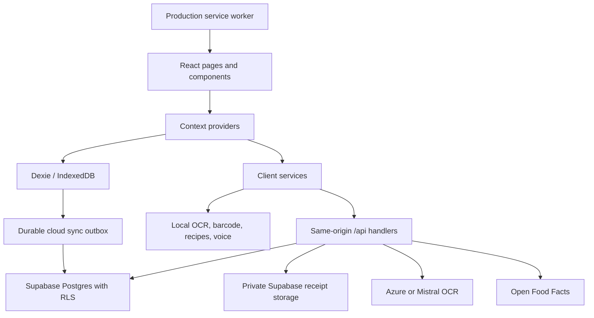
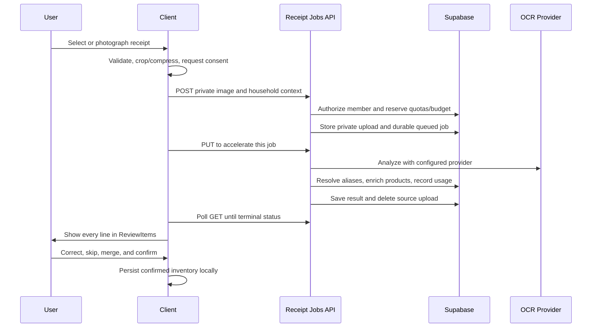

# No Fridge Spoil: Cursor Project Handover

Last updated: 2026-08-21

Repository: `C:\Users\chris\No Fridge Spoil`

Primary branch: `main`

## 1. Read This First

No Fridge Spoil is a local-first grocery inventory PWA. It tracks food, expiration dates,
shopping lists, alerts, meal plans, recipes, household profiles, and receipt scans. It can run
without a cloud account. When Supabase is configured and a user signs in, IndexedDB remains the
offline cache and a durable outbox synchronizes household data to Supabase.

The modern platform tree is on `main` (checkpoint `7909077`, CI-parity merge `0c8fbf4`).
At the 2026-08-21 IPIE refresh:

- Hosted CI now runs typecheck, PWA e2e, and `npm audit --audit-level=high` (PR #2).
- Draft PRs #3–#5 cover receipt recovery, shorthand expansion, and provider-neutral OCR diagnostics.
- Do not reset, clean, restore, or check out files to make the tree look tidy.
- Do not assume an untracked file is disposable.
- Inspect `git status --short` before editing and preserve changes outside the requested scope.
- Continuing work follows `.cursor/rules/ipie-loop.mdc` and `docs/IPIE_LOOP.md`.

The canonical source of truth is the live source plus passing tests. Some historical documents
describe work as pending even though it has since been implemented. See Section 17.

## 2. Product Summary

### Customer value

The product helps a household answer four practical questions:

1. What food is on hand?
2. What should be used first?
3. What can be cooked with current inventory?
4. What needs to be bought next?

### Main customer journeys

- Add an item manually, by barcode, by camera, or from a receipt.
- Review OCR output before any receipt lines become inventory.
- Track expiration urgency by fridge, freezer, or pantry.
- Receive expiration alerts and add reminders to a calendar.
- Build and manage a shopping list with quantities and undo support.
- Browse local recipe recommendations and enter guided Cook Mode.
- Plan meals for the week.
- Review impact estimates and achievements.
- Use the app entirely on one device or create a cloud account for household sync.
- Invite household members and manage roles.
- Export, restore, retain, or permanently delete account and receipt data.

### Product stance

- Local-first, not account-first.
- Manual review is a feature, especially for ambiguous receipt shorthand.
- Receipt images are sensitive. Minimize retention and require consent for cloud upload.
- Deterministic parsing and verified aliases are preferred over ungrounded model guesses.
- Cloud OCR must be server-side, metered, budgeted, and replaceable.

## 3. Current Technical Stack

| Layer | Technology |
| --- | --- |
| Frontend | React 19, TypeScript 5.9, Vite 7 |
| Styling | Large custom CSS system in `src/index.css`, Tailwind/PostCSS support |
| Icons | Phosphor Icons primarily; Lucide is also installed |
| Local data | Dexie 4 over IndexedDB, Zod validation |
| Cloud data | Supabase Auth, Postgres, Storage, Row Level Security |
| Server runtime | Vercel TypeScript functions using Fetch `Request`/`Response` handlers |
| Receipt OCR | Azure Document Intelligence or Mistral OCR, selected server-side |
| Local OCR | Lazy-loaded Tesseract.js fallback |
| Barcode data | `html5-qrcode` plus cached Open Food Facts lookups |
| Unit tests | Vitest, Testing Library, jsdom, fake IndexedDB |
| Browser tests | Playwright with separate device, PWA, and cloud configurations |
| Deployment | Vercel only |
| PWA | Custom service worker in `public/sw.js` |

Local toolchain observed at handover: Node `v24.12.0`, npm `11.6.2`. CI currently uses
Node 22. The package does not declare an `engines` field.

## 4. Architecture At A Glance



### Application composition

`src/main.tsx` mounts:

1. `StrictMode`
2. `ErrorBoundary`
3. `App`

`src/App.tsx` composes providers in this order:

1. `ThemeProvider`
2. `AuthProvider`
3. `AccountGate`
4. `ProfileProvider`
5. `InventoryProvider`
6. `AppContent`

`AccountGate` does not block device-only use. It starts cloud sync only when cloud configuration,
a valid session, and an active household are all present. Password recovery is the one focused
full-screen account state.

### Routing

There is no React Router dependency. `src/App.tsx` and `src/utils/routing.ts` implement a small
hash router. Routes are lazy-loaded:

| Hash | View |
| --- | --- |
| `#/` | Inventory / Fresh Market home |
| `#/scan` | Camera, item, barcode, batch, and receipt capture |
| `#/alerts` | Expiration alerts and reminder settings |
| `#/shop` | Shopping list |
| `#/profile` | Local/cloud profile, sync, privacy, account, OCR health |
| `#/recipes` | Recipe catalogue and inventory recommendations |
| `#/planner` | Meal planner |
| `#/stats` | Impact and achievements |

Unknown hashes normalize to inventory. Query parameters, including invite links, must remain
intact. Route changes reset the main scroll position. Bottom navigation preloads likely routes
on pointer or keyboard intent.

## 5. Frontend Ownership Map

### Pages

| File | Primary responsibility |
| --- | --- |
| `src/pages/Inventory.tsx` | Home inventory, filtering, urgency sorting, onboarding checklist |
| `src/pages/Scan.tsx` | Capture orchestration for item, barcode, batch, and receipt modes |
| `src/pages/Alerts.tsx` | Expiration groups, reminder settings, actions, calendar export |
| `src/pages/ShoppingList.tsx` | List editing, quantities, options menu, undo flows |
| `src/pages/Profile.tsx` | Accounts, household collaboration, sync, backup, privacy, OCR health |
| `src/pages/Recipes.tsx` | Catalogue search, recommendations, recipe detail |
| `src/pages/MealPlanner.tsx` | Weekly planning and accessible recipe picker |
| `src/pages/Stats.tsx` | Impact methodology, sharing, achievements |

### High-impact components

| File | Notes |
| --- | --- |
| `src/components/ReviewItems.tsx` | Receipt review and correction; large and behavior-sensitive |
| `src/components/SplashScreen.tsx` | CSS motion intro; once per session; reduced-motion aware |
| `src/components/BottomNav.tsx` | Primary navigation, alert count, route preloading |
| `src/components/AccountAccess.tsx` | Sign in, signup, reset, and recovery UI |
| `src/components/SyncStatusBar.tsx` | Offline, update, and sync feedback |
| `src/components/BarcodeScanner.tsx` | Camera barcode flow and capability recovery |
| `src/components/CookMode.tsx` | Full-screen guided cooking experience |
| `src/hooks/useModalFocus.ts` | Shared initial focus, Tab trap, Escape, and focus restoration |

### UI direction

The selected direction is a premium editorial grocery experience:

- Warm white surfaces, dark bottle green, restrained status colors.
- Cormorant Garamond display typography plus DM Sans UI typography.
- Product and ingredient photography as meaningful content.
- Flat, information-dense page bands rather than nested decorative cards.
- Compact mobile-first controls with accessible labels and practical tap targets.
- Stable bottom navigation and clear scan action.

Preserve existing tokens and layout conventions in `src/index.css`. Do not introduce a second
visual system casually. The last recorded design QA covered 320 x 700, 390 x 844, and
1024 x 900 viewports. See `design-qa.md` for the prior visual evidence.

## 6. Local Data Model

`src/db/database.ts` owns the Dexie database. The current browser schema is version 10.

Important tables:

- `items`: inventory records and soft deletes.
- `stats`: all-time impact and gamification state.
- `settings`: theme, notification, and expiration preferences.
- `shoppingList`: local/cloud shopping records.
- `customTags`: custom categorization metadata.
- `barcodeCache`: local product lookup cache.
- `aiCache`: bounded local processing cache; the name is historical.
- `notificationLog`: duplicate-prevention and notification history.
- `mealPlans`: weekly plans.
- `profiles`: household subprofiles.
- `syncOutbox`: durable pending cloud writes and conflict evidence.
- `syncState`: last synchronization cursors/state.
- `receiptQueue`: expiring private local blobs for failed receipt retries.
- `receiptHistory`: sanitized receipt processing metadata and optional preview blobs.

Zod schemas live in `src/db/schemas.ts`. Validate data at persistence and import boundaries.
Date-only fields use strict `YYYY-MM-DD` calendar validation from `src/utils/dateValidation.ts`.
Do not parse date-only values through UTC and then display them as local dates.

### Local mutation contract

Cloud-syncable local mutations must use `localMutationFields()` from
`src/services/localMutationService.ts`. It updates `updatedAt`, marks `syncPending`, and attaches
the active cloud household when one exists. Bypassing this helper can create silent sync gaps.

### Device backup

The device backup format is version 3. Export/restore code lives in `src/db/database.ts` and UI
lives in Profile. Restore is previewed, schema-validated, strips cloud-only fields, and applies
valid records atomically. Do not change the format without compatibility tests and an explicit
version migration.

## 7. Accounts, Households, And Cloud Sync

### Account behavior

- If browser-safe Supabase values are absent, the app runs in device-only mode.
- If configured, account access appears in Profile rather than blocking the app.
- Supabase Auth uses PKCE and persisted sessions.
- Session restoration is bounded by a five-second timeout.
- Signup creates a user and default household through database triggers.
- Password reset returns to `/#/profile`.
- Account deletion requires email confirmation and clears the deleted local auth session.

### Household behavior

Households support owner, admin, and member roles. Collaboration operations are exposed through
`api/household.ts` and `src/services/householdService.ts`:

- Roster retrieval
- Invite creation, acceptance, and cancellation
- Member role changes and removal
- Ownership transfer

Destructive member and ownership operations require named confirmations in the UI.

### Cloud synchronization

`src/services/cloudSyncService.ts` owns synchronization. Its key properties are:

- IndexedDB remains the local read/write surface.
- Pending writes are captured in `syncOutbox`.
- Entity order is profile, inventory, shopping, then meal plan.
- Sync starts only for an authenticated active household.
- Device-only records are not uploaded automatically.
- Profile shows an explicit migration preview/action for unassigned records.
- Cloud version timestamps detect cross-device conflicts.
- Users can resolve current conflicts with device or cloud versions.
- A periodic sync runs every 60 seconds and also reacts to connectivity.

Do not replace this with direct component-to-Supabase writes. That would break offline behavior,
outbox durability, explicit migration, and conflict handling.

## 8. Supabase Backend

There are seven ordered migrations under `supabase/migrations/`:

1. `20260715000000_account_cloud_foundation.sql`
2. `20260716000000_receipt_job_queue.sql`
3. `20260716010000_household_collaboration.sql`
4. `20260716020000_receipt_item_resolution.sql`
5. `20260725000000_receipt_project_budgets.sql`
6. `20260725010000_receipt_job_reaper.sql`
7. `20260725020000_product_lookup_cache.sql`

The foundation includes users, households, memberships, household profiles, inventory,
shopping, meal plans, receipt usage, private rate-limit buckets, triggers, RLS policies, and
retention cleanup. Later migrations add the receipt queue, collaboration, aliases, project
budgets, job reaping, and persistent product cache.

### Security boundary

- Browser clients receive only the Supabase URL and publishable key.
- RLS is the tenant isolation boundary for browser requests.
- `SUPABASE_SECRET_KEY` bypasses RLS and is server-only.
- Server handlers authenticate the bearer session and re-authorize household membership.
- Raw IP addresses are not stored. A secret-salted HMAC bucket is used for rate limiting.
- Service-only catalog and operational tables are not exposed to normal clients.

Any schema change requires a new ordered migration. Never edit a migration already applied to a
shared environment. Run both `npm run verify:migrations` and the cloud verifier after changes.

## 9. Receipt Capture And Item Resolution

Receipt capture is the most sensitive and complex feature.

### End-to-end flow



### Client orchestration

- `src/pages/Scan.tsx`: capture mode and UI state.
- `src/services/imageCompressionService.ts`: cancellable image compression.
- `src/services/receiptImageQualityService.ts`: dimensions and quality checks.
- `src/services/receiptOCRService.ts`: health, jobs, polling, retries, history, privacy data.
- `src/services/scanQueueService.ts`: cancellable multi-image processing.
- `src/components/ReviewItems.tsx`: all user review and confirmation.

Failed cloud receipt images are stored as expiring IndexedDB blobs, not base64 localStorage.
Current limits are ten receipts, 20 MB total, and seven-day retention. Receipt previews are
opt-in. Legacy retry payloads are cleaned during queue access.

### Server orchestration

- `api/receipt-jobs.ts`: authenticated job create/read/process endpoint.
- `server/receiptJobs.ts`: lease, processing, retry, completion, and upload cleanup.
- `api/receipt-worker.ts`: cron-protected bounded recovery worker.
- `api/maintenance.ts`: retention, invite cleanup, job reaping, orphan upload cleanup.
- `api/receipt-ocr.ts`: provider configuration, consent, quotas, budget, provider calls.
- `server/receiptResolution.ts`: aliases and product enrichment.

The browser-triggered `PUT` is an acceleration path. The durable database job is the source of
truth. Vercel Hobby cron currently runs daily, so immediate browser processing is important for
normal scans and cron is recovery. A higher-frequency durable worker is a future scaling task.

### OCR providers

`RECEIPT_OCR_PROVIDER` selects `azure` or `mistral` on the server. Optional cross-provider
fallback requires both `RECEIPT_OCR_CLOUD_FALLBACK_ENABLED=true` and a configured fallback.

Azure uses Document Intelligence and defaults to `prebuilt-receipt`. Azure polling validates
that `operation-location` is HTTPS and belongs to the configured Azure origin.

Mistral uses `MISTRAL_OCR_MODEL` and maps its output to the same normalized receipt contract.
Do not allow the client to choose a provider or receive provider credentials.

### Consent, quotas, and cost controls

- Cloud upload consent can be required with `RECEIPT_OCR_REQUIRE_USER_CONSENT=true`.
- Daily user and household quotas are reserved atomically.
- Monthly project page and USD budgets are enforced atomically.
- Provider usage and estimated cost are recorded with each attempt.
- Missing cost is represented as zero/unknown, never an invented charge.
- Provider fallback should remain disabled until measured on the same consented corpus.

### Shorthand resolution

`src/services/receiptItemResolver.ts` is deterministic and conservative. It handles:

- Store-scoped brand tokens such as Great Value or Kirkland.
- Stable grocery abbreviations.
- Item codes, counts, package sizes, and sold-by-weight metadata.
- Coupon, tax, subtotal, tender, and other non-item lines.
- Household aliases and catalog aliases.
- Alternatives, unresolved tokens, field confidence, and resolution method.

The original OCR description remains evidence. Ambiguous or tied matches are review-only. A
user-confirmed alias is scoped to household and merchant. Do not build a cross-household private
purchase dictionary.

### Local capture

- Native barcode/text detectors are used when available.
- `html5-qrcode` provides barcode support.
- Tesseract.js is the lazy browser-local OCR fallback.
- Manual product/produce entry is the guaranteed fallback.
- PaddleOCR was proposed in historical planning but is not implemented.

## 10. Recipes, Alerts, Voice, And PWA

### Recipes

Recipes are local and deterministic. The structured catalogue lives in
`src/data/recipeCatalog.ts`; matching lives in `src/services/recipeService.ts`. There is no
Gemini recipe dependency. Tests inject a reference date where time affects recommendations.

### Alerts and notifications

`src/services/notificationScheduler.ts` periodically re-reads settings, permission, frequency,
and quiet hours. `src/services/notificationService.ts` attempts service-worker delivery with a
bounded wait and falls back to the page Notification API. Duplicate-prevention history is written
only after delivery is accepted.

Calendar reminders use all-day date-safe ICS generation. Keep date-only calculations in local
calendar space.

### Voice

Voice intent parsing is deterministic. Speech output uses browser `speechSynthesis`; no Google
TTS key is needed. Microphone and speech capabilities must degrade gracefully.

### Service worker

`src/main.tsx` is the only registration owner:

- Development unregisters old service workers and clears app caches.
- Production registers `/sw.js?production=1`.
- The production PWA test verifies service-worker installation and offline shell reload.
- `public/sw.js` uses an explicit cache version. Bump it when changing shell caching behavior.

Do not add another inline registration to `index.html`.

## 11. Server API Inventory

| Endpoint | Methods | Responsibility |
| --- | --- | --- |
| `/api/health` | GET | Minimal public health; cron-auth detailed queue/provider health |
| `/api/account` | GET, DELETE | Account export and guarded permanent deletion |
| `/api/household` | GET, POST, PATCH, DELETE | Roster, invites, roles, removal, ownership |
| `/api/receipt-aliases` | POST | Authenticated household alias learning |
| `/api/receipt-jobs` | GET, POST, PUT | Durable receipt job lifecycle |
| `/api/receipt-ocr` | GET, POST | Provider health and direct normalized analysis primitives |
| `/api/receipt-worker` | GET, POST | Cron-auth bounded job recovery |
| `/api/maintenance` | GET | Cron-auth retention and reaping |

The Vite dev middleware mirrors most APIs for normal development, but not every scheduled
operation. Use `npm run dev:full` when Vercel routing/function parity matters.

## 12. Environment Configuration

Start from `.env.example`. Never paste real secrets into documentation, source, issue text, or
browser-prefixed variables.

### Browser-safe

- `VITE_SUPABASE_URL`
- `VITE_SUPABASE_PUBLISHABLE_KEY`
- Legacy compatibility only: `VITE_SUPABASE_ANON_KEY`

### Server-only Supabase and operations

- `SUPABASE_URL`
- `SUPABASE_PUBLISHABLE_KEY`
- `SUPABASE_SECRET_KEY`
- `RATE_LIMIT_SALT`
- `CRON_SECRET`

### Server-only Azure

- `AZURE_DOCUMENT_INTELLIGENCE_ENDPOINT`
- `AZURE_DOCUMENT_INTELLIGENCE_KEY`
- `AZURE_DOCUMENT_INTELLIGENCE_MODEL_ID`
- `AZURE_CUSTOM_RECEIPT_MODEL_APPROVED`
- `AZURE_DOCUMENT_INTELLIGENCE_COST_PER_PAGE_USD`

### Server-only routing and budgets

- `RECEIPT_OCR_PROVIDER`
- `RECEIPT_OCR_FALLBACK_PROVIDER`
- `RECEIPT_OCR_CLOUD_FALLBACK_ENABLED`
- `RECEIPT_OCR_REQUIRE_USER_CONSENT`
- `RECEIPT_OCR_MONTHLY_PAGE_BUDGET`
- `RECEIPT_OCR_MONTHLY_USD_BUDGET`
- `RECEIPT_WORKER_BATCH_SIZE`

### Optional Mistral and product data

- `MISTRAL_API_KEY`
- `MISTRAL_OCR_MODEL`
- `MISTRAL_OCR_COST_PER_PAGE_USD`
- `OPEN_FOOD_FACTS_USER_AGENT`

Any `VITE_*` value is public in the browser bundle. Never prefix an OCR key, secret Supabase key,
rate-limit salt, or cron secret with `VITE_`.

## 13. Local Development Runbook

### Device-only frontend

```powershell
npm ci
npm run dev
```

Open `http://127.0.0.1:5173/`. If 5173 is occupied, Vite may choose another port because the base
server config does not set `strictPort`.

### Local cloud stack

Docker Desktop must be running.

```powershell
npx --yes supabase@latest start
npx --yes supabase@latest status
```

Populate `.env.local` with the local Supabase URL, publishable key, server secret key, an
independent `RATE_LIMIT_SALT`, and an independent `CRON_SECRET`. Use `.env.example` as the name
and privacy contract.

For a disposable local schema reset:

```powershell
npx --yes supabase@latest db reset --local --no-seed
```

This is destructive to the local Supabase database. Never run it against a linked/shared project.

### Vercel parity

```powershell
npm run dev:full
```

Use this when checking actual Vercel function routing, cron behavior, or deployment environment
parity. Normal `npm run dev` includes custom middleware for the primary customer APIs.

### Current runtime state at handover

- Docker Desktop/Supabase is stopped as of the 2026-08-12 handover check.
- This is an environment state, not a known application regression.
- The full cloud release gate last passed immediately before shutdown on 2026-08-11 local time.
- Start Docker and Supabase before running cloud verification.

## 14. Verification And Release Gates

### Fast checks while editing

```powershell
npm run typecheck
npm run lint
npm run test:run
```

Use a focused Vitest file during iteration, then run the full suite before handoff.

### Production build

```powershell
npm run build
```

This performs TypeScript build validation, Vite production output, bundle budget checks, and a
build scan for retired Google credentials/endpoints.

### Browser suites

| Command | Environment | Expected shape |
| --- | --- | --- |
| `npm run test:e2e` | Device-only Vite on 5174 | Main customer flows; cloud lifecycle skipped |
| `npm run test:e2e:pwa` | Built preview on 4174 | Production service worker and offline shell |
| `npm run test:e2e:cloud` | `.env.local`, local Supabase, Vite on 5175 | Full mobile account lifecycle |

### Canonical gates

```powershell
npm run verify:release
npm run verify:release:cloud
```

`verify:release` covers device-only release safety. `verify:release:cloud` is the canonical full
gate when local Supabase is available.

Last fully verified result:

- Exact command: `npm run verify:release:cloud`
- Exit code: 0
- TypeScript: passed
- ESLint: passed
- Vitest: 53 files, 356 tests passed
- Production build: passed
- Bundle/PWA budgets: passed
- Build secret scan: passed across 36 text assets
- Migrations: seven ordered migrations verified
- Device E2E: eight passed, cloud test intentionally skipped there
- Production PWA E2E: one passed, including offline reload
- Cloud foundation verifier: passed
- Cloud mobile account lifecycle: one passed
- Dependency audit: zero vulnerabilities

Cloud verification covers auth, tenant RLS, aliases, service-only catalog access, quotas, usage,
export, guarded deletion, anonymization, and retention cleanup.

### CI caveat

`.github/workflows/ci.yml` on Node 22 now runs migration verification, typecheck, lint, build,
unit tests, device E2E, production PWA E2E, and `npm audit --audit-level=high`. It still does not
run the cloud foundation suite or cloud E2E. Local `verify:release:cloud` remains stronger when
Supabase is available.

## 15. Deployment

Vercel is the only supported target. Netlify configuration and the retired Remotion intro package
were removed. Static-only hosting is not sufficient because account and receipt workflows depend
on `api/` handlers.

```powershell
npm run deploy:vercel
```

`deploy:vercel` runs the device release gate before `vercel --prod`. Before a production launch,
also run the cloud gate in an environment configured for the target backend.

`vercel.json` defines:

- Vite build and `dist` output.
- Function duration limits.
- Daily receipt-worker and maintenance schedules compatible with Vercel Hobby.
- SPA rewrites.
- Service-worker and manifest headers.
- CSP, frame denial, referrer policy, content-type protection, and permissions policy.

Before public signup:

1. Configure production Supabase Auth URLs.
2. Configure custom SMTP.
3. Enable CAPTCHA and review Auth rate limits.
4. Confirm RLS and migration state against the target project.
5. Set intentional nonzero OCR pricing and budgets.
6. Keep provider fallback disabled until benchmarked.
7. Confirm old browser-exposed Google credentials were revoked in their issuing project.
8. Run production account, receipt, retention, and deletion smoke tests with sanitized data.

## 16. Security And Privacy Invariants

Treat these as release blockers:

1. No server secret may appear in browser code, logs, screenshots, or documentation.
2. `SUPABASE_SECRET_KEY` stays in server handlers only.
3. Every household server operation authenticates and authorizes membership.
4. RLS remains enabled on tenant tables.
5. Receipt cloud upload requires the configured consent signal.
6. Source receipt uploads are private and deleted after success or terminal failure.
7. Raw IP addresses are never persisted.
8. Ambiguous receipt lines are not silently accepted as inventory.
9. Account deletion remains guarded when household ownership affects others.
10. Production builds must pass `security:scan-dist`.

The current artifact scanner specifically blocks Google API key shapes, Gemini endpoints, Google
TTS endpoints, and the retired Google GenAI SDK marker. It is not a general secret scanner. Add
patterns carefully when introducing another provider.

## 17. Documentation Authority And Staleness

Use documents in this order:

1. Live source and migrations.
2. Passing tests and the latest command output.
3. This handover.
4. `README.md` for operator setup.
5. Implementation cycle notes for feature history.
6. Audit and provider planning documents for rationale, not current status.

Current/historical documents:

- `docs/implementation-1-10-2026-07-25.md`: current hardening implementation summary.
- `docs/implementation-11-20-2026-07-25.md` through `51-60`: implemented UX cycles.
- `docs/receipt-item-resolution-plan.md`: current safety principles for shorthand.
- `design-qa.md`: prior visual QA evidence.
- `docs/panel-review-2026-07-25.md`: historical review that predates subsequent fixes.
- `docs/gemini-removal-and-cost-plan.md`: historical migration plan. Its opening status is stale.

Do not reintroduce Gemini because an older file says replacement is pending. Active source and the
production bundle are Google/Gemini-free. Local OCR currently uses Tesseract, not the proposed
PaddleOCR worker.

## 18. Known Gaps And Recommended Next Work

### P0: Preserve and checkpoint the current tree

Done on `main` (`7909077` publish, later CI-parity merges). If a dirty tree reappears, inspect
`git status --short` and do not blindly stage or clean it.

### P1: Strengthen hosted CI

Device-side hosted CI parity landed in PR #2 (`typecheck`, PWA e2e, high-severity audit, `engines`).
Still open: a disposable Supabase job for cloud foundation / cloud E2E if secrets and Docker
service constraints are acceptable.

### P1: Build a real receipt benchmark

The deterministic shorthand corpus is useful but does not prove image-level OCR quality. Build a
consented, de-identified, retailer-diverse receipt corpus and measure:

- Item-line recall and precision.
- Merchant and receipt-date accuracy.
- Quantity/weight/package extraction.
- Non-item rejection.
- Review rate and incorrect high-confidence acceptance.
- Mobile latency, memory, and upload size.
- Azure versus Mistral on the exact same corpus.

Keep fallback disabled until the comparison is defensible.

### P1: Improve unattended receipt recovery

Draft PR #3 adds client-side retry of the private `receiptQueue` while a signed-in household is
online. Vercel Hobby cron remains daily last-resort recovery. Still open: persist/resume server
`jobId` to avoid a second quota reservation, and a more frequent durable server trigger
(Supabase Cron/Edge or a queue) that keeps leasing, bounded batches, idempotency, cleanup, and
budget checks.

### P2: Remove provider-label assumptions in client diagnostics

Draft PR #5 makes client/API fallbacks provider-neutral and prefers the server-returned identity.
Keep new diagnostic copy on that contract; do not hardcode Azure.

### P2: Split maintenance hotspots

The largest maintenance surfaces remain:

- `src/components/ReviewItems.tsx`
- `src/pages/Scan.tsx`
- `src/pages/Profile.tsx`
- `src/index.css`
- Receipt/server orchestration files

Refactor only with characterization tests. Good candidates are a receipt review reducer, smaller
field components, feature-scoped CSS modules/layers, and provider-neutral OCR types in a shared
module. Avoid a broad aesthetic or architecture rewrite while the working tree is uncheckpointed.

### P2: Validate real browser hardware

Automated file-upload tests do not prove physical camera/microphone behavior. Repeat manual tests
on at least iOS Safari and Android Chrome for:

- Camera permission denial and recovery.
- Rear-camera fallback.
- Background/foreground stream release.
- Barcode scan.
- Large receipt image decode/compression.
- Tesseract load time and memory.
- Notification permission and delivery.
- Offline install/update behavior.

### P3: Revisit local OCR engine only with evidence

PaddleOCR remains a possible future replacement, but adding it creates model-download, worker,
memory, CSP, cache, and mobile performance costs. Benchmark it against the existing Tesseract path
before changing the production dependency.

## 19. Safe Change Recipes

### Add or change a page

1. Follow existing page and editorial CSS conventions.
2. Update hash routing and bottom navigation only if a new top-level destination is justified.
3. Keep route imports lazy.
4. Add an app-health or feature-surface E2E assertion.
5. Check 320, 390, and desktop widths.

### Change local persistent data

1. Add a Dexie schema version if indexes/table structure change.
2. Add a migration path for existing records.
3. Update Zod validation and backup import/export.
4. Preserve sync metadata and soft-delete behavior.
5. Add fake-IndexedDB tests.

### Change cloud data

1. Add a new timestamped Supabase migration.
2. Add/verify RLS, grants, and tenant-column protection.
3. Update cloud mapping and outbox behavior.
4. Extend `verify-cloud-foundation.ts`.
5. Run `verify:release:cloud` against a disposable local stack.

### Change receipt OCR

1. Preserve the normalized client contract.
2. Keep provider credentials server-side.
3. Preserve consent, quota, budget, retry, lease, and cleanup paths.
4. Preserve raw-line evidence and review-only ambiguity.
5. Add mapper, protected API, job, resolver, and E2E tests.
6. Update the bundle/security gate if a provider introduces new forbidden client surfaces.

### Change service-worker behavior

1. Keep registration in `src/main.tsx` only.
2. Bump the cache version in `public/sw.js` when required.
3. Run `npm run build` before PWA tests.
4. Run `npm run test:e2e:pwa` and verify offline reload.

## 20. Cursor Start Checklist

For the next Cursor session:

1. Read this file and `.cursor/rules/project-handover.mdc`.
2. Run `git status --short`; do not clean the tree.
3. Read the exact modules and tests related to the requested change.
4. Check whether Docker/Supabase is needed and currently running.
5. Make a focused change that follows existing ownership boundaries.
6. Run focused tests, then typecheck/lint.
7. For release-sensitive changes, run `npm run verify:release`.
8. For auth, RLS, sync, household, receipt quota, retention, or deletion changes, run
   `npm run verify:release:cloud` with the local stack.
9. Report current evidence honestly. Distinguish skipped, unavailable, stale, and passed checks.
10. Leave unrelated dirty files untouched.

## 21. Handover Status

The project is a functioning, tested local-first application with optional Supabase collaboration
and provider-neutral server OCR. `main` is checkpointed and hosted device CI matches the local
device release gate. Continuing work uses the IPIE loop. Immediate product concerns: merge or
iterate draft PRs #3–#5, then a consented receipt-image benchmark and durable server-side
recovery before broad production rollout.

